# Proyecto Express con mongo (servidor) y Angular 12 (cliente)

# Índice

- [Proyecto Express con mongo (servidor) y Angular 12 (cliente)](#proyecto-express-con-mongo-servidor-y-angular-12-cliente)
- [Índice](#índice)
- [Resumen](#resumen)
- [Pasos realizados](#pasos-realizados)
  - [1. Crear un tag](#1-crear-un-tag)
  - [2. Creación Rama main_dockerfile](#2-creación-rama-main_dockerfile)
  - [3. Creacion Dockerfile del frontend](#3-creacion-dockerfile-del-frontend)
    - [3.1. Arreglando la carga de assets del frontend](#31-arreglando-la-carga-de-assets-del-frontend)
  - [4. Prueba de creación de imagen del frontend](#4-prueba-de-creación-de-imagen-del-frontend)
  - [5. Creación Dockerfile del backend](#5-creación-dockerfile-del-backend)
  - [6. Build de la imagen truequepop-backend](#6-build-de-la-imagen-truequepop-backend)
  - [7. Creación del script](#7-creación-del-script)
  - [8. Verificar que funciona](#8-verificar-que-funciona)

# Resumen

Se ha programado un script que comprueba si las imágenes ya están construidas de antes y si no, se ejecuta docker image build sobre los 2 Dockerfiles.
El script también comprueba si están los contenedores parados o si no existen, los crea y los arranca.

# Pasos realizados

## 1. Crear un tag

Creamos el tag en la rama master del repositorio con `git tag`:

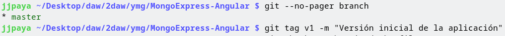

```bash
git tag v1 -m "Versión inicial de la aplicación"
git push origin --tags
```

## 2. Creación Rama main_dockerfile
Se ha creado la rama main_dockerfile con el comando git checkout -b

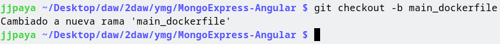

```bash
git checkout -b main_dockerfile
```

## 3. Creacion Dockerfile del frontend
Se crean los archivos para construir la imagen de docker. Se añade un .dockerignore para no copiar la carpeta dist y node_modules.

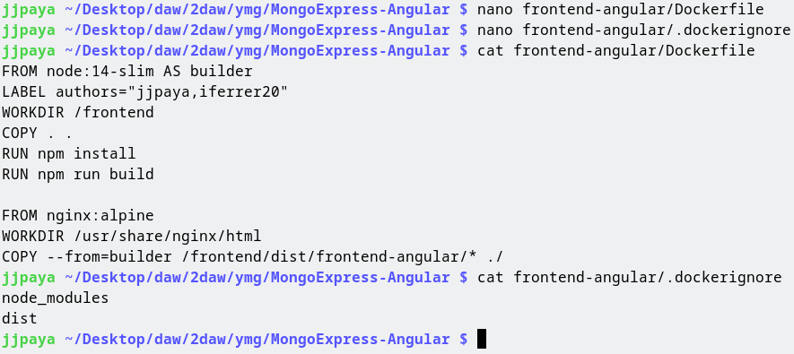

Este Dockerfile es multi-stage. Eso quiere decir que varios contenedores se involucran en la creación de la imagen, útil para reducir el tamaño final.

Se ha usado la imagen `node:14-slim` para compilar el frontend por varias razones:
- La version 14 de node es LTS
- Esta fue la version en la que el frontend se desarrolló
- La versión slim hace que se tenga que descargar menos contenido de internet al construir la imagen

En la primera fase del Dockerfile se ejecuta `npm install` para generar la carpeta node_modules, y luego `npm run build` para compilar el frontend.

Una vez hecho esto, pasamos a la siguiente fase de la construcción de la imagen, esta vez con la imagen `nginx:alpine`. Elijo la version alpine porque ocupa mucho menos que la version normal.

Copio todos los archivos de la compilación anterior encontrados en `/frontend/dist/frontend-angular/` del contenedor anterior (con la opción `--from=builder`) a la carpeta `/usr/share/nginx/html/`

No necesito especificar `EXPOSE` o `CMD` porque esto se hereda de la imagen `nginx:alpine`, ya viene por defecto.

### 3.1. Arreglando la carga de assets del frontend

Se ha tenido que cambiar una propiedad en tsconfig.json para arreglar la carga de los assets (imágenes)

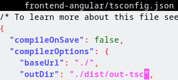

Se ha cambiado a:

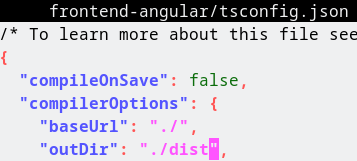

Esto es para que los assets se copien a la carpeta ./assets/ correctamente, ya que las imagenes se copiaban a ./ sin este cambio.

## 4. Prueba de creación de imagen del frontend

Se comprueba si la imagen se puede construir correctamente:

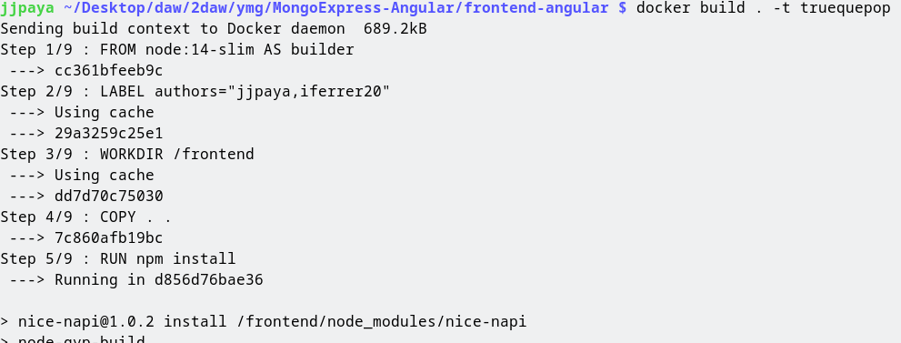

Y se puede comprobar que sí:

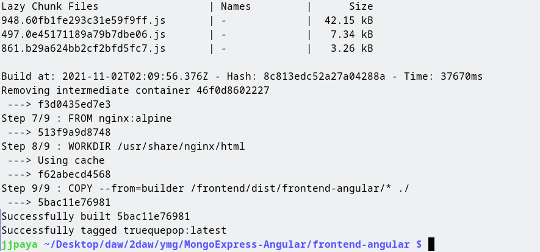

Y esta es la imagen resultante:

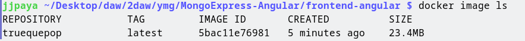

Podemos ver que el peso de la imagen es muy ligero.

## 5. Creación Dockerfile del backend
Se crean los archivos para construir la imagen de docker para el backend. Se copia el .dockerignore para no copiar la carpeta dist y node_modules.

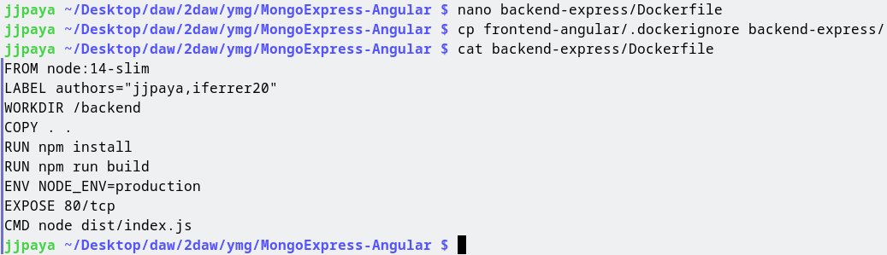

Igual que antes, se ha usado la imagen node:14-slim por varias razones:
- La version 14 de node es LTS
- Esta fue la version en la que el backend se desarrolló
- La versión slim hace que la imagen final ocupe menos

Se ejecuta npm install para construir la carpeta node_modules y npm run build para compilar los archivos para producción.

Después de compilar, se establece la variable de entorno `NODE_ENV=production` para avisar al servidor de que esta en modo producción.

El comando para ejecutar será `node dist/index.js` que es el archivo principal al compilar. Escucha en el puerto 80 por TCP, por eso se pone `EXPOSE 80/tcp`

## 6. Build de la imagen truequepop-backend
Buildeamos la imagen truequepop-backend

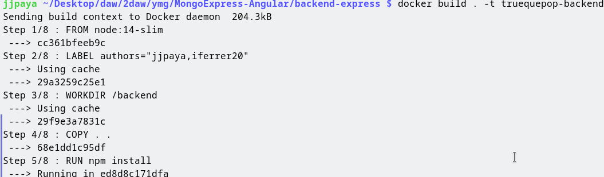
```bash
docker build . -t truequepop-backend
```

## 7. Creación del script

Se ha creado el siguiente script:

```bash
#!/bin/bash
set -eo pipefail

is_frontend_built() {
	[[ ! -z "$(docker images -q truequepop-frontend)" ]];
	return $?;
}

is_backend_built() {
	[[ ! -z "$(docker images -q truequepop-backend)" ]];
	return $?;
}

has_backend_container() {
	[[ ! -z "$(docker ps -aqf name=truequepop-backend)" ]];
	return $?;
}

has_frontend_container() {
	[[ ! -z "$(docker ps -aqf name=truequepop-frontend)" ]];
	return $?;
}

has_db_container() {
	[[ ! -z "$(docker ps -aqf name=land_db)" ]];
	return $?;
}

build_frontend() {
	docker image build frontend-angular/ -t truequepop-frontend
}

build_backend() {
	docker image build backend-express/ -t truequepop-backend
}

if [[ $1 == "--help" ]]; then
	echo "Usage: $0 [--rebuild]"
	echo "Options:"
	echo "  --rebuild: Always build the images, even if already built."
fi

if ( ! is_frontend_built || [[ $1 == "--rebuild" ]] ) && ! build_frontend; then
	echo "Couldn't build the frontend!"
	exit 1
fi

if ( ! is_backend_built || [[ $1 == "--rebuild" ]] ) && ! build_backend; then
	echo "Couldn't build the backend!"
	exit 1
fi

docker network create truequepop_net &>/dev/null || true

if ! has_db_container; then
	docker run --network truequepop_net -d --name land_db -e MONGO_INITDB_ROOT_USERNAME=root -e MONGO_INITDB_ROOT_PASSWORD=land mongo:4.4
else
	docker start land_db
fi

if ! has_backend_container; then
	docker run --network truequepop_net --name truequepop-backend -d -p 8081:80 truequepop-backend
else
	docker start truequepop-backend
fi

if ! has_frontend_container; then
        docker run --network truequepop_net --name truequepop-frontend -d -p 8080:80 truequepop-frontend
else
	docker start truequepop-frontend
fi
```

El script se puede ejecutar con `--rebuild` para construir siempre las imagenes aunque ya estén creadas.

Se puede observar que para que el backend funcione se necesita crear un contenedor de mongodb. En este contenedor de mongo he tenido que especificar las variables de entorno `MONGO_INITDB_ROOT_USERNAME` y `MONGO_INITDB_ROOT_PASSWORD` para establecer las credenciales utilizadas por el backend al conectarse.

Todos los contenedores se crean bajo la red `truequepop_net` para que puedan comunicarse entre sí, y se exponen los puertos 8080 y 8081 para el frontend y backend, respectivamente.

## 8. Verificar que funciona

Se ejecuta el script y se comprueba que funciona:

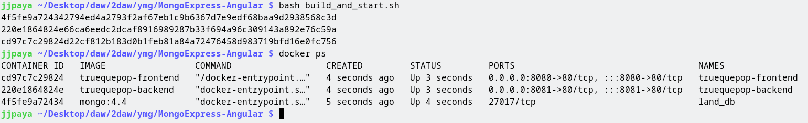

Se comprueba con el navegador:

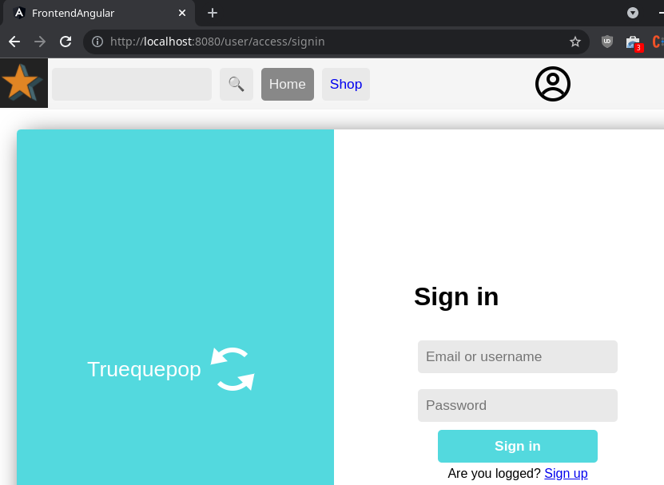

# Subir imagenes a docker hub

Para subir la imagen a docker hub necesitamos crear una cuenta primero en docker hub, una vez creada la cuenta necesitamos creé los repositorios de las imagenes, luego cambié el nombre de la imagen para poner iferrer20/, luego necesito logearme con docker login, y luego hago un docker push iferrer20/<nombre imagen>

Imagen backend
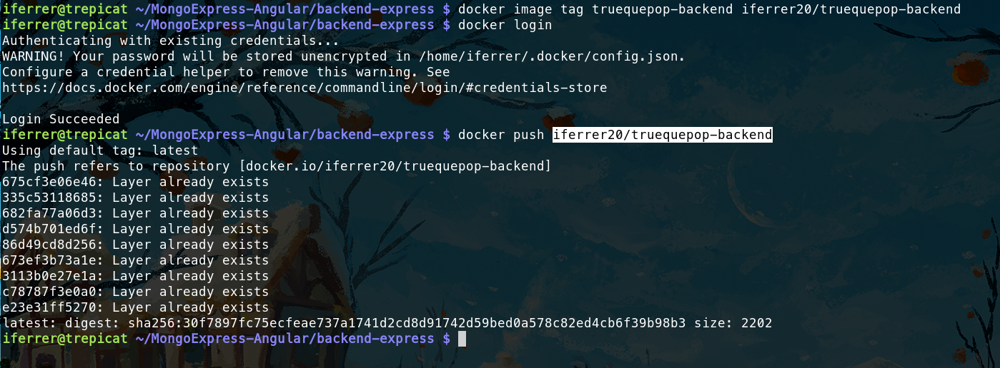
Imagen frontend
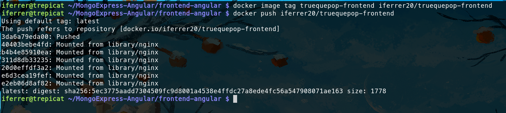

```bash
# Imagen backend
docker image tag truequepop-backend iferrer20/truequepop-backend
docker login
docker push iferrer20/truequepop-backend
# Imagen frontend
docker image tag truequepop-frontend iferrer20/truequepop-frontend
docker push iferrer20/truequepop-frontend
```
