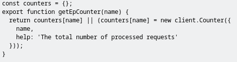
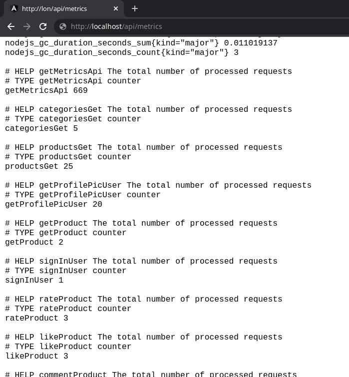

# Práctica Docker Compose

- [Práctica Docker Compose](#práctica-docker-compose)
  - [Introducción](#introducción)
  - [¿Qué es docker-compose?](#qué-es-docker-compose)
    - [Instalar docker-compose en ubuntu](#instalar-docker-compose-en-ubuntu)
  - [¿Qué es kubernetes?](#qué-es-kubernetes)
    - [Instalar kubectl en ubuntu](#instalar-kubectl-en-ubuntu)
  - [Instalar aplicación para desarrollo](#instalar-aplicación-para-desarrollo)
  - [Instalar aplicación para producción](#instalar-aplicación-para-producción)
    - [Dockerfile cliente angular](#dockerfile-cliente-angular)
    - [Dockerfile del servidor](#dockerfile-del-servidor)
    - [Docker-compose de producción (docker-compose.prod.yml)](#docker-compose-de-producción-docker-composeprodyml)
  - [Registro de datos con Prometheus y Grafana](#registro-de-datos-con-prometheus-y-grafana)
    - [Docker-compose](#docker-compose)
    - [datasources.yml](#datasourcesyml)
    - [Registrar todos los endpoints en Prometheus](#registrar-todos-los-endpoints-en-prometheus)

## Introducción
Este documento tratará de explicar los pasos realizados para desplegar la aplicación realizada en el módulo servidor.
El documento explicará como podemos desplegar tanto el cliente y servidor, en modo desarrollo o producción y finalmente como poder tener un control sobre los logs de nuestra aplicación.

## ¿Qué es docker-compose?
Compose es una herramienta para definir y ejecutar aplicaciones Docker de contenedores múltiples. Con Compose, utiliza un archivo YAML para configurar los servicios de su aplicación. Luego, con un solo comando, crea e inicia todos los servicios desde su configuración.

Compose funciona en todos los entornos: producción, puesta en escena, desarrollo, pruebas, así como flujos de trabajo de CI.

Usar Compose es básicamente un proceso de tres pasos:

* Defina el entorno de su aplicación con un Dockerfile para que pueda reproducirse en cualquier lugar.
* Defina los servicios que componen su aplicación docker-compose.yml para que puedan ejecutarse juntos en un entorno aislado.
* Ejecutar docker-compose up y Compose inicia y ejecuta toda su aplicación.

### Instalar docker-compose en ubuntu
```bash
sudo curl -L "https://github.com/docker/compose/releases/download/1.29.2/docker-compose-$(uname -s)-$(uname -m)" -o /usr/local/bin/docker-compose
sudo chmod +x /usr/local/bin/docker-compose
sudo ln -s /usr/local/bin/docker-compose /usr/bin/docker-compose
```

## ¿Qué es kubernetes? 
Kubernetes, también conocido como K8s, es un sistema de código abierto para administrar aplicaciones en contenedores en múltiples hosts. Proporciona mecanismos básicos para la implementación, el mantenimiento y el escalado de aplicaciones.
Para usar Kubernetes necesitaremos **kubectl** que es una interfaz de línea de comandos para ejecutar comandos sobre despliegues clusterizados de Kubernetes

### Instalar kubectl en ubuntu
```bash
curl -LO "https://dl.k8s.io/release/$(curl -L -s https://dl.k8s.io/release/stable.txt)/bin/linux/amd64/kubectl"
```

## Instalar aplicación para desarrollo
Para usar la aplicación en modo desarrollo vamos a disponer de un fichero `docker-compose.yml`, no dispondremos de ningún Dockerfile, los Dockerfiles los usaremos en la parte de Producción.
El docker-compose contendrá los siguientes servicios:
* web: Este servicio es un servidor nginx que servirá nuestra aplicación al cliente, esta contiene un proxy_pass a la aplicación de angular (/ -> http://land_frontend) y al servidor (/api/ -> http://land_backend).
* db: Este servicio es la base de datos mongo que se encargará de guardar toda la información de nuestro servidor
* backend: Este servicio se encargará de ejecutar el servidor de la aplicación mediante el script `.startnode.sh` 
* frontend: Este servicio se encargará de ejecutar el servidor de desarrollo angular mediante el script `.startnode.sh`

```yml
version: "3"  
services:
  web:
    image: nginx:latest
    container_name: "land_web"
    networks:
      - land_network
    ports:
      - "80:80"
      - "443:443"
    volumes:
      - ./config/nginx-dev.conf:/etc/nginx/conf.d/default.conf:ro
  db:
    image: mongo:4.4
    command: --quiet --logpath /dev/null
    networks:
      - land_network
    container_name: "land_db"
      #volumes:
    environment:
      - MONGO_INITDB_ROOT_USERNAME=root
      - MONGO_INITDB_ROOT_PASSWORD=land
    volumes:
      - ./scripts/mongorestore.sh:/docker-entrypoint-initdb.d/mongorestore.sh
      - ./data/db/:/docker-entrypoint-initdb.d/db/
  backend:
    image: node:14-alpine
    container_name: "land_backend"
    networks:
      - land_network
    working_dir: /home/node/app
    volumes: 
      - ./backend-express:/home/node/app
      - ./data/img/:/home/node/app/img
    command: sh ./.startnode.sh
  frontend:
    image: node:14-alpine
    container_name: "land_frontend"
    networks:
      - land_network
    working_dir: /home/node/app
    volumes:
      - ./frontend-angular:/home/node/app
    command: sh ./.startnode.sh
networks:
  land_network:
```

El fichero `.startnode` se encargará de iniciar las aplicaciones de node en modo desarrollo.

```sh
#!/bin/sh

#Perms
uid=`stat -c '%u' .`
gid=`stat -c '%g' .`

sed -i -e "s/^node:x:[0-9]*:[0-9]*:/node:x:${uid}:${gid}:/" /etc/passwd
chown ${uid}:${gid} /home/node
chown ${uid}:${gid} /home/node/app/dist

# Install and run
su node -c "npm install && npm start"
```

El script pondrá el uid y gid correctos sobre el usuario node (haciendo sed del fichero /etc/passwd) luego cambiará los permisos de las carpetas con chown, esto asegurará que nuestra aplicación se ejecute con el id de usuario y grupo de usuario correctos.

Luego ejecutará como usuario node `npm install` (generar la carpeta node_modules) y `npm start` (inicia nuestra aplicación)

Finalmente cuando tengamos el `docker-compose.yml` lo iniciaremos con `docker-compose up`


Podemos ver que el servidor de angular esta listo


## Instalar aplicación para producción
Ahora que tenemos la aplicación en modo desarrollo, primero necesitamos crear los dockerfiles tanto en cliente como servidor, estas imagenes prepararán nuestra aplicación y la compilará, una vez compilada nos generará las 2 imágenes para cliente y servidor.

### Dockerfile cliente angular
Este dockerfile contiene un multistage build, que se encargará de compilar la aplicación y copiarlo a la imagen de nginx, para ello usamos `COPY --from=builder /frontend/dist/* ./`
Utilizando un multistage build conseguimos que la imagen final sea mucho más ligera.

```dockerfile
FROM node:14-slim AS builder
LABEL authors="jjpaya,iferrer20"
WORKDIR /frontend
COPY . .
RUN npm install
RUN npm run build

FROM nginx:alpine
WORKDIR /usr/share/nginx/html
COPY --from=builder /frontend/dist/* ./
```

### Dockerfile del servidor
Este dockerfile también compilará nuestro proyecto pero sin multistage build
```dockerfile
FROM node:14-slim
LABEL authors="jjpaya,iferrer20"
WORKDIR /backend
COPY . .
RUN npm install
RUN npm run build
ENV NODE_ENV=production
EXPOSE 80/tcp
CMD node dist/index.js
```

### Docker-compose de producción (docker-compose.prod.yml)
Para usar la aplicación en modo producción vamos a disponer de un fichero `docker-compose.yml`, usando los Dockerfiles creados anteriormente.
El docker-compose contendrá los siguientes servicios:
* web: Este servicio es un servidor nginx que servirá nuestra aplicación al cliente, esta contiene un proxy_pass a la aplicación compilada de angular (otro nginx) (/ -> http://land_frontend) y al servidor (/api/ -> http://land_backend).
* db: Este servicio es la base de datos mongo que se encargará de guardar toda la información de nuestro servidor
* backend: Este servicio tendrá la aplicación del servidor express ya precompilada.
* frontend: Este servicio tendrá la aplicación del cliente angular ya precompilada.

```yml
version: "3"
services:
  web:
    image: nginx:latest
    container_name: "land_web_prod"
    networks:
      - land_network
    ports:
      - "80:80"
      - "443:443"
    volumes:
      - ./frontend-angular/dist:/usr/share/nginx/html:ro
      - ./config/nginx-prod.conf:/etc/nginx/conf.d/default.conf:ro
    depends_on:
      - backend
      - frontend
  db:
    image: mongo:4.4
    command: --quiet --logpath /dev/null
    networks:
      - land_network
    container_name: "land_db_prod"
    environment:
      - MONGO_INITDB_ROOT_USERNAME=root
      - MONGO_INITDB_ROOT_PASSWORD=land
    volumes:
      - ./scripts/mongorestore.sh:/docker-entrypoint-initdb.d/mongorestore.sh
      - ./data/db/:/docker-entrypoint-initdb.d/db/
  backend:
    build: ./backend-express/
    container_name: "land_backend_prod"
    networks:
      - land_network
    working_dir: /backend
    environment:
      - PROD=1
    volumes:
      - ./backend-express:/home/node/app
      - ./data/img/:/home/node/app/img
  frontend:
    build: ./frontend-angular/
    container_name: "land_dev_prod"
    networks:
      - land_network
    working_dir: /home/node/app
    volumes:
      - ./frontend-angular:/home/node/app
networks:
  land_network:
```

Con el script de mongorestore.sh en docker-entrypoint-initdb.d/ cargará una base de datos de ejemplo únicamente cuando se ejecute por primera vez

## Registro de datos con Prometheus y Grafana

### Docker-compose

Se ha creado un docker-compose para el sistema de logs:

```yml
version: '3'
services:
  prometheus:
    image: prom/prometheus:v2.20.1
    container_name: prometheus_practica
    networks:
    - land_network
    ports:
    - "9090:9090"
    volumes:
    - ./config/prometheus.yml:/etc/prometheus/prometheus.yml
    command:
    - --config.file=/etc/prometheus/prometheus.yml
  grafana:
    image: grafana/grafana:7.1.5
    container_name: grafana_practica
    networks:
    - land_network
    ports:
    - "3500:3000"
    volumes:
    - ./config/datasources.yml:/etc/grafana/provisioning/datasources/datasources.yml
    - myGrafanaVol:/var/lib/grafana
    environment:
      GF_AUTH_DISABLE_LOGIN_FORM: "true"
      GF_AUTH_ANONYMOUS_ENABLED: "true"
      GF_AUTH_ANONYMOUS_ORG_ROLE: Admin
      GF_INSTALL_PLUGINS: grafana-clock-panel 1.0.1
    depends_on:
    - prometheus
volumes:
  myGrafanaVol:
networks:
  land_network:
```

Podemos comprobar que se ha utilizado la misma red que los docker-compose de producción y desarrollo, para que Prometheus pueda obtener las métricas del backend REST.
Acompañado de este docker-compose está la configuración de Grafana y Prometheus explicadas a continuación.

###	prometheus.yml

Se configura el prometheus para que recoja las métricas del backend de express directamente, con una ruta diferente a la habitual, agregando /api/ al principio.

```yml
global:
  scrape_interval: 5s
  evaluation_interval: 30s
scrape_configs:
  - job_name: "land_backend"
    honor_labels: true
    metrics_path: '/api/metrics'
    static_configs:
      - targets: ["land_backend:80"]
```

Si iniciamos los servicios de la aplicación y de logging podemos ver que Prometheus encuentra el Target y lo registra correctamente:


Y si incrementamos los contadores de las APIs podemos ver que los cambios se muestran:


### datasources.yml

Y en el grafana se configura para que recoja los datos del contenedor de Prometheus.

```yml
apiVersion: 1
datasources:
  - name: Prometheus
    type: prometheus
    access: proxy
    orgId: 1
    url: prometheus_practica:9090
    basicAuth: false
    isDefault: true
    editable: true
```

En Grafana podemos ver los contadores registrados en Prometheus y llevar un seguimiento de los datos:


### Registrar todos los endpoints en Prometheus

Se han registrado todos los endpoints en Prometheus con una función de ayuda para simplificar el código `getEpCounter`:



Se ha utilizado en todos los endpoints para incrementar su contador:


Y las podemos ver en http://localhost/api/metrics:



Un detalle de esta función de ayuda para registrar los contadores es que no se registran hasta que se incrementen almenos 1 vez.


